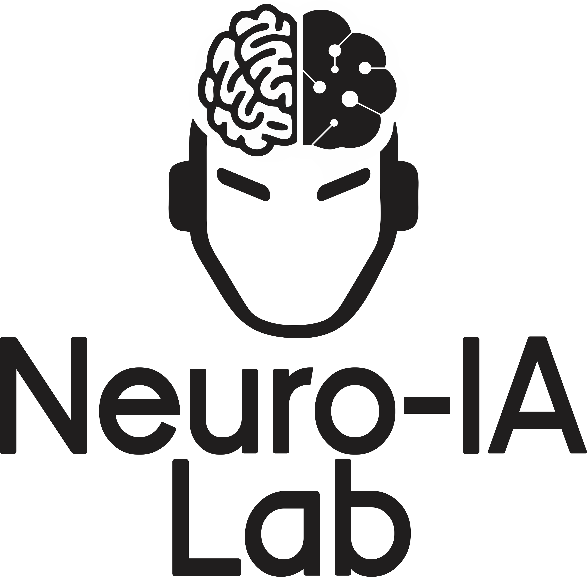

# Handwriting Project (Python)

Proyecto para estudiar la factibilidad de decodificación del trazo continuo de letras del alfabeto español a partir del electroencefalograma.

Este repositorio contiene los script en Python para generar, gestionar y almacenar eventos. Enviar mensajes hacia la tablet donde se presentan los estímulos, recibir mensajes de la tablet, entre otras tareas.

La aplicación de la tablet puede encontrarse en [Handwriting Project - Android app](https://github.com/lucasbaldezzari/handwritingrecording)

#### Versión 1.0.0

Se implementa:

- SessionManager para control de rondas de entrenamiento, ejecutadas e imaginadas.
- PreExperimentManager para control de rondas basal, emg y eog.
- SessionInfo para almacenar información importante de la sesión, ronda, runs, etc.
- Entornos gráficos para configuración de diferentes parámetros de la sesión, de la ronda, etc. También para lanzar el experimento. Entre otras posibilidades.

Para correr la sesión se debe hacer desde consola

> python -m pyhwr.widgets.InitAPP

NOTA: Se recomienda crear un environment, activarlo y ejecutar luego.

## Cominucación USB

En este proyeco, para poder conectar la PC o Laptop a la tablet es necesario contar con *Android Debug Bridge (adb)*.

Para instalar *adb* se debe ingresar a la página oficial de Android Developers y descargar la versión adecuada desde [acá](https://developer.android.com/tools/releases/platform-tools). Una vez descargado, descomprimir y agregar la carpeta a las Variables de Entorno de Windows, de esta manera, se podrá ejecutar *adb* desde consola.

NOTA: Podes encontrar la versión utilizada en este proyecto dentro de la carpeta [adb]() de este repositorio.